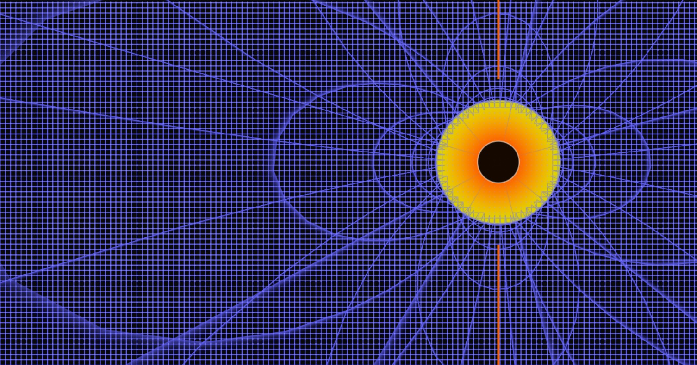

A Javascript clone of nowykurier's Gravity Toy.

#Improvements

DEMO [https://ravendano014.github.io/Gravity.js/]

#TODO:
- [ ] Correct Physics Black Hole & Neutron Stars
- [ ] Improve Interface
- [ ] Make it Funnier
- [ ] Credit all [Projects by Thatcher Chamberlin](https://jthatch.com/Gravity.js/main.html)

Files minimized with minifier from npm.

* Inspired on [Nowy Kurier Gravity Toy](http://www.nowykurier.com/toys/gravity/gravity.html)
* You can donwload [Flash Player 10 Win Stand Alone](https://github.com/ravendano014/Gravity.js/raw/refs/heads/master/Flash%20Player%2010%20%5BWin%5D%20%5BStand%20Alone%5D.exe) and load [Gravity.swf](https://github.com/ravendano014/Gravity.js/raw/refs/heads/master/gravity.swf) (Nostalgic original file)

